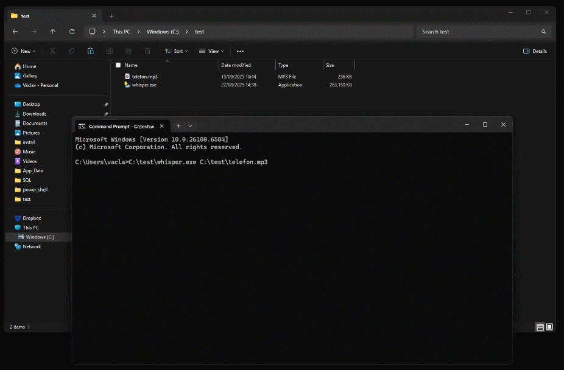

# Windows CLI aplikace "Whisper.exe"
Tato Windows command line aplikace převede hlasový soubor MP3 na textovou zprávu.
- Cesta k MP3 souboru se zadává jako vstupní parametr aplikace: <code>whisper.exe C:\test\telefon.mp3</code>
- Výstup se provede na <code>STDOUT</code>.
- Výstup z aplikace je opatřen tagy pro jeho případné další zpracování.
- Pro použitý ropoznávací model <code>turbo</code> je nutno mít k dispozici přibližně 16GB RAM.
 

